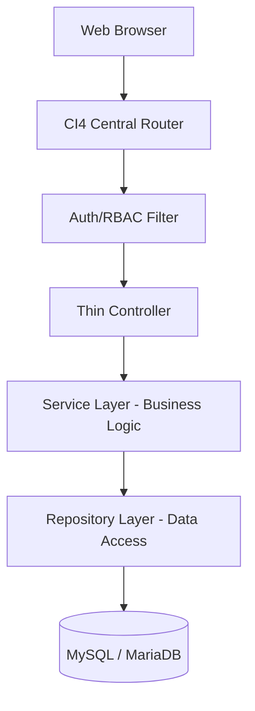

# WMVAA Akademia - Architectural Blueprint

This document details the system design, programming standards, and data layers of **WMVAA Akademia** (Integrated Academic Planning System).

---

## 1. System Overview

WMVAA Akademia is a unified, modular, single-codebase application serving both **SMP** and **SMA** levels under a unified academic planning ecosystem.



---

## 2. Core Constraints

1. **Strict Separation of Units**: SMP and SMA data are differentiated via `unit_id` at the database level.
2. **Unified Data Structures**: Global Master files are kept for Teachers and Subjects to enable cross-unit loading.
3. **Layered Architecture**:
   - **Controllers**: Handlers for HTTP request parsing, response formatting, and validation trigger. No business logic.
   - **Services**: Business logic validators, calculation engines (schedule heuristics, piket fairness, workload limits).
   - **Repositories**: CRUD and custom queries. No direct Query Builder or SQL inside controllers or views.
   - **Models**: Standard CI4 Models for schema definition.

---

## 3. Modular Folder Structure

The application follows CodeIgniter 4's modular structure.

```
app/
├── Config/            # App settings and routing
├── Filters/           # Auth and CSRF filters
├── Modules/
│   ├── Dashboard/     # Main control panel
│   ├── SchoolUnits/   # SMP & SMA configuration
│   ├── AcademicPeriods/# Semester / Year versioning
│   ├── Teachers/      # Master teacher and workload
│   └── UserManagement/# Users, roles, permissions (RBAC)
```

---

## 4. Security Framework

- **Authentication**: Native secure session-based authentication with password hashing (bcrypt), login rate limiting, and session rotation.
- **Access Control**: Role-Based Access Control (RBAC) enforced strictly at the controller/filter level.
- **CSRF**: Token verification required for all POST/PUT/DELETE requests.
- **XSS**: Escaping data using `esc()` on rendering.
