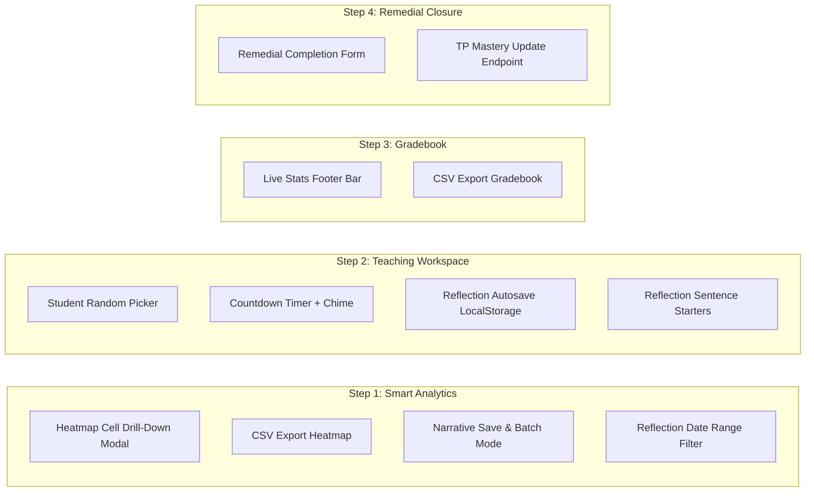

# Rencana Implementasi: Level 2 — Deep Functional Enhancements

Level 1 (UI polish & workflow shortcuts) sudah selesai. Level 2 berfokus pada **kedalaman fungsional**: drill-down interaktif, persistensi data, alat mengajar real-time, dan workflow end-to-end.

---

## Ringkasan 4 Langkah Level 2



---

## User Review Required

> [!IMPORTANT]
> - Semua perubahan bersifat **backward-compatible** — tidak ada perubahan skema database.
> - Narrative save memerlukan kolom `narrative_draft` di tabel `mastery_records` atau tabel baru `student_narrative_drafts`. Rekomendasi: **tabel baru** agar tidak mengubah skema existing.
> - Remedial completion akan menulis langsung ke `mastery_records` — pastikan guru yang mengakses memiliki permission `assessments.manage`.

> [!WARNING]
> - CSV export menggunakan `fputcsv()` PHP native (tanpa library eksternal).
> - Student randomizer dan countdown timer adalah **client-side only** (tidak menyentuh backend).

---

## Step 1: Smart Analytics Drill-Down & Export

### Komponen 1.1: Heatmap Cell Drill-Down Modal + CSV Export

#### [MODIFY] [mastery_heatmap.php](file:///e:/xampp/htdocs/wmvaa.id/public_html/app.wmvaa.id/wmvaa-akademia/app/Views/smart/mastery_heatmap.php)
- **Drill-Down Modal**: Klik cell heatmap → buka modal `#heatmapCellModal` menampilkan:
  - Nama siswa & kode TP
  - Status mastery saat ini (badge warna)
  - Link langsung ke **Paket Remedial** (untuk `NEEDS_SUPPORT`/`DEVELOPING`)
  - Link langsung ke **Draf Narasi** siswa tersebut
- **Quick Filter Buttons**: Tombol filter cepat di atas matriks:
  - `Semua Siswa` | `< 50% Tercapai` | `≥ 75% Tercapai`
  - Filter client-side via `display:none` pada baris tabel
- **CSV Export Button**: Tombol `📥 Ekspor CSV` di header → download matriks lengkap sebagai `.csv`

---

### Komponen 1.2: Narrative Drafter — Save, Character Counter & Batch Mode

#### [MODIFY] [SmartAnalyticsController.php](file:///e:/xampp/htdocs/wmvaa.id/public_html/app.wmvaa.id/wmvaa-akademia/app/Controllers/SmartAnalyticsController.php)
- Tambah method `saveNarrativeDraft()` — menerima `POST` dengan `student_id`, `subject_id`, `classroom_id`, `narrative_text` → simpan ke tabel `student_narrative_drafts`

#### [MODIFY] [Routes.php](file:///e:/xampp/htdocs/wmvaa.id/public_html/app.wmvaa.id/wmvaa-akademia/app/Config/Routes.php)
- Tambah route `POST smart/narrative-drafter/save`

#### [NEW] [StudentNarrativeDraftModel.php](file:///e:/xampp/htdocs/wmvaa.id/public_html/app.wmvaa.id/wmvaa-akademia/app/Models/StudentNarrativeDraftModel.php)
- Model sederhana untuk tabel `student_narrative_drafts` (`id`, `student_id`, `subject_id`, `classroom_id`, `academic_period_id`, `narrative_text`, `created_at`, `updated_at`)

#### [NEW] [Migration CreateStudentNarrativeDraftsTable](file:///e:/xampp/htdocs/wmvaa.id/public_html/app.wmvaa.id/wmvaa-akademia/app/Database/Migrations/20260820000000_CreateStudentNarrativeDraftsTable.php)
- Tabel baru `student_narrative_drafts` dengan unique constraint `(student_id, subject_id, classroom_id, academic_period_id)`

#### [MODIFY] [narrative_drafter.php](file:///e:/xampp/htdocs/wmvaa.id/public_html/app.wmvaa.id/wmvaa-akademia/app/Views/smart/narrative_drafter.php)
- **Tombol Simpan**: AJAX `POST` ke `smart/narrative-drafter/save` dengan toast konfirmasi
- **Character Counter**: Live counter `0 / 300 karakter` di bawah textarea, merah jika >300
- **Indikator Draft Tersimpan**: Badge `💾 Tersimpan` atau `⏳ Belum Disimpan` di samping textarea

---

### Komponen 1.3: Reflection Trends — Date Range Filter

#### [MODIFY] [SmartAnalyticsController.php](file:///e:/xampp/htdocs/wmvaa.id/public_html/app.wmvaa.id/wmvaa-akademia/app/Controllers/SmartAnalyticsController.php)
- Method `reflectionTrends()` menerima query param `from_date` dan `to_date`, diteruskan ke `ReflectionTrendsService`

#### [MODIFY] [ReflectionTrendsService.php](file:///e:/xampp/htdocs/wmvaa.id/public_html/app.wmvaa.id/wmvaa-akademia/app/Services/ReflectionTrendsService.php)
- Tambah parameter `$fromDate` dan `$toDate` pada method utama, diterapkan sebagai `WHERE ls.date BETWEEN`

#### [MODIFY] [reflection_trends.php](file:///e:/xampp/htdocs/wmvaa.id/public_html/app.wmvaa.id/wmvaa-akademia/app/Views/smart/reflection_trends.php)
- Tambah input `date` untuk `from_date` dan `to_date` di baris filter

---

## Step 2: Teaching Workspace Live In-Class Tools

### Komponen 2.1: Student Random Picker & Countdown Timer

#### [MODIFY] [session.php](file:///e:/xampp/htdocs/wmvaa.id/public_html/app.wmvaa.id/wmvaa-akademia/app/Views/teaching/session.php)
- **🎲 Panggil Siswa Acak**: Tombol di toolbar atas → SweetAlert animasi dengan nama siswa terpilih secara acak dari daftar kehadiran
- **⏱️ Timer Mundur**: Tombol `Mulai Timer` dengan preset cepat (5, 10, 15, 20 menit) → countdown overlay di sudut kanan bawah dengan progress ring SVG dan notifikasi suara saat habis (`new Audio()` beep)
- **⌨️ Keyboard Shortcuts**: `Alt+O` = fokus ke catatan observasi, `Alt+P` = panggil siswa acak, `Space` = pause/resume stopwatch (saat tidak di textarea/input)

---

### Komponen 2.2: Reflection Form — Autosave & Sentence Starters

#### [MODIFY] [reflect.php](file:///e:/xampp/htdocs/wmvaa.id/public_html/app.wmvaa.id/wmvaa-akademia/app/Views/teaching/reflect.php)
- **LocalStorage Autosave**: Setiap perubahan pada textarea/input otomatis disimpan ke `localStorage` dengan key `reflect_{sessionUuid}_{fieldName}`. Saat form dibuka kembali, nilai di-restore otomatis. Dihapus setelah submit berhasil.
- **Clickable Sentence Starters**: Chip buttons di atas setiap textarea utama:
  - *What went well*: `+ Antusiasme Siswa`, `+ Analogi Efektif`, `+ Kolaborasi Aktif`, `+ Semua TP Tercapai`
  - *Challenges*: `+ Waktu Tidak Cukup`, `+ Miskonsepsi Muncul`, `+ Diferensiasi Sulit`, `+ Perangkat Bermasalah`
  - Klik → append teks ke textarea (bukan replace)

---

## Step 3: Gradebook Productivity

### Komponen 3.1: Live Statistics Footer & CSV Export

#### [MODIFY] [gradebook.php](file:///e:/xampp/htdocs/wmvaa.id/public_html/app.wmvaa.id/wmvaa-akademia/app/Views/assessment/gradebook.php)
- **Live Stats Footer Bar**: Sticky bar di bawah layar yang otomatis recalculate saat guru mengetik skor:
  - `Rata-rata Kelas: XX.X` (auto-update via `input` event listener)
  - `Siswa Lengkap: X / Y` (count cells with non-empty score)
  - `Perlu Pendampingan: X` (count scores < 70)
- **CSV Export**: Tombol `📥 Ekspor Nilai (.csv)` di header → client-side generate CSV dari data tabel → `Blob` download

---

## Step 4: Remedial Package Workflow Closure

### Komponen 4.1: Remedial Completion & TP Mastery Update

#### [MODIFY] [SmartAnalyticsController.php](file:///e:/xampp/htdocs/wmvaa.id/public_html/app.wmvaa.id/wmvaa-akademia/app/Controllers/SmartAnalyticsController.php)
- Tambah method `completeRemedial()` — menerima `POST` dengan `student_id`, `objective_id`, `new_result`, `remedial_notes` → update `mastery_records` dan redirect kembali ke heatmap

#### [MODIFY] [Routes.php](file:///e:/xampp/htdocs/wmvaa.id/public_html/app.wmvaa.id/wmvaa-akademia/app/Config/Routes.php)
- Tambah route `POST smart/remedial/complete`

#### [MODIFY] [remedial_package.php](file:///e:/xampp/htdocs/wmvaa.id/public_html/app.wmvaa.id/wmvaa-akademia/app/Views/smart/remedial_package.php)
- **Form Verifikasi Remedial** (tidak tampil saat print): Card hijau di bawah lembar remedial berisi:
  - Dropdown `Status Mastery Baru` (ACHIEVED / DEVELOPING / ADVANCED)
  - Input `Catatan Bukti Remedial`
  - Tombol `✅ Perbarui TP & Selesaikan Remedial`
- Setelah submit → redirect ke mastery heatmap dengan flash `success`

---

## Verification Plan

### Automated Tests
```powershell
# Existing test suite (regression)
& "E:\xampp\php82\php.exe" vendor/bin/phpunit tests/Feature/SmartAnalyticsRoutesTest.php tests/unit/SmartAnalyticsTest.php tests/Security/AssessmentRouteSecurityTest.php --no-coverage

# Migration test
& "E:\xampp\php82\php.exe" spark migrate --all
```

### Manual Verification
1. Buka **Mastery Heatmap** → klik cell → verifikasi modal drill-down dengan link remedial/narasi
2. Buka **Draf Narasi** → edit → klik Simpan → reload → verifikasi data tersimpan
3. Buka **Tren Refleksi** → set date range → verifikasi data terfilter
4. Buka **Sesi Mengajar** → klik 🎲 Panggil Siswa Acak → verifikasi popup
5. Buka **Sesi Mengajar** → mulai Timer Mundur 5 menit → verifikasi countdown & chime
6. Buka **Refleksi** → ketik teks → tutup tab → buka kembali → verifikasi teks ter-restore
7. Buka **Gradebook** → isi skor → verifikasi rata-rata & counter auto-update
8. Buka **Paket Remedial** → isi form verifikasi → submit → verifikasi TP terupdate di heatmap
