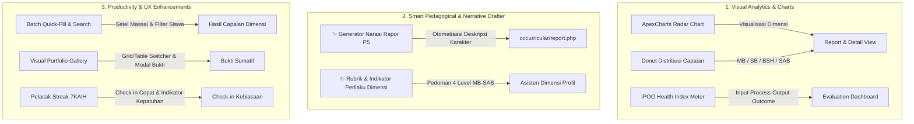

# Implementation Plan — Peningkatan Cerdas & Modern UI/UX Fase 7 (Kokurikuler, Dimensi Profil, Karakter & 7KAIH)

Rencana peningkatan komprehensif untuk menyempurnakan modul **Kokurikuler, Ekstrakurikuler, Dimensi Profil Lulusan & Karakter (Fase 7)** dengan fitur analitik cerdas, visualisasi modern (ApexCharts), generator narasi rapor P5, galeri bukti portofolio, dan pelacak kebiasaan 7KAIH.

---

## Proposed Changes



---

### File & Komponen yang Akan Ditingkatkan

#### 1. Backend Service Layer & AI Controller
- **[MODIFY] [`app/Services/CocurricularService.php`](file:///e:/xampp/htdocs/wmvaa.id/public_html/app.wmvaa.id/wmvaa-akademia/app/Services/CocurricularService.php):**
  - Tambahkan metode `generateStudentNarrative(int $programId, int $studentId): string` untuk menyusun narasi rapor P5 otomatis berbasis capaian dimensi tertinggi dan catatan observasi.
  - Tambahkan metode `calculateIpooHealth(int $programId): array` untuk menghitung skor rata-rata per aspek Input, Process, Output, Outcome dan skor kesehatan program total.
  - Tambahkan metode `dimensionDescriptorRubric(): array` untuk menyediakan deskriptor perilaku standar per dimensi profil lulusan.
- **[MODIFY] [`app/Controllers/CocurricularController.php`](file:///e:/xampp/htdocs/wmvaa.id/public_html/app.wmvaa.id/wmvaa-akademia/app/Controllers/CocurricularController.php):**
  - Tambahkan endpoint AJAX `GET cocurricular/(:num)/student-narrative/(:num)` untuk generate draf narasi siswa secara instan.
  - Tambahkan endpoint AJAX `GET cocurricular/rubric-descriptors` untuk asisten deskriptor dimensi.

#### 2. Visualisasi Laporan & Radar Dimensi Profil
- **[MODIFY] [`app/Views/cocurricular/report.php`](file:///e:/xampp/htdocs/wmvaa.id/public_html/app.wmvaa.id/wmvaa-akademia/app/Views/cocurricular/report.php):**
  - Integrasikan **ApexCharts Radar Chart** untuk memvisualisasikan rata-rata pencapaian dimensi profil lulusan di kelas.
  - Integrasikan **ApexCharts Donut / Stacked Bar** distribusi level (`EMERGING`, `DEVELOPING`, `PROFICIENT`, `EXEMPLARY`).
  - Tambahkan generator draf narasi per siswa dengan tombol **Salin Narasi** (1-click clipboard) dan indikator status capaian profil unggulan.

#### 3. Ruang Kerja Hasil Dimensi & Galeri Bukti Portofolio
- **[MODIFY] [`app/Views/cocurricular/detail.php`](file:///e:/xampp/htdocs/wmvaa.id/public_html/app.wmvaa.id/wmvaa-akademia/app/Views/cocurricular/detail.php):**
  - **Tab Hasil Dimensi:** Tambahkan tombol quick-fill (`Set Semua BSH/PROFICIENT`), kolom pencarian siswa langsung, live progress bar pengisian sekelas, dan tombol ekspor CSV matriks dimensi.
  - **Tab Bukti Sumatif:** Tambahkan toggle tampilan (*Tabel vs Grid Kartu Galeri Bukti*) dan modal preview foto/dokumen karya siswa.
  - **Tab Evaluasi (IPOO):** Tampilkan kartu IPOO Score Meter (Input, Process, Output, Outcome) dengan progress bar warna dan skor indeks mutu.
  - Tambahkan modal *"✨ Pedoman Level Dimensi Profil"* yang memuat deskripsi indikator perilaku `MB`, `SB`, `BSH`, `SAB`.

#### 4. Pelacak Kebiasaan & Karakter 7KAIH
- **[MODIFY] [`app/Views/cocurricular/checkins.php`](file:///e:/xampp/htdocs/wmvaa.id/public_html/app.wmvaa.id/wmvaa-akademia/app/Views/cocurricular/checkins.php):**
  - Tambahkan visual streak counter & badge kepatuhan mingguan (%).
  - Tombol aksi cepat: *Check-in Semua Siswa Hadir/Terlaksana*.
  - Ringkasan statistik kepatuhan kebiasaan harian.

---

## Verification Plan

### Automated Tests
- Eksekusi test suite komprehensif:
  ```powershell
  & "E:\xampp\php82\php.exe" vendor/bin/phpunit tests/database/CocurricularEngineTest.php tests/Security/CocurricularRouteSecurityTest.php tests/Feature/SmartAnalyticsRoutesTest.php --no-coverage
  ```
- Tambahkan unit test di `CocurricularEngineTest` untuk validasi `generateStudentNarrative` dan `calculateIpooHealth`.

### Manual Verification
- Buka antarmuka web di browser:
  - `http://app.wmvaa.local/wmvaa-akademia/cocurricular`
  - `http://app.wmvaa.local/wmvaa-akademia/cocurricular/1` (detail & 6 tabs)
  - `http://app.wmvaa.local/wmvaa-akademia/cocurricular/1/report` (grafik radar & narasi rapor P5)
  - `http://app.wmvaa.local/wmvaa-akademia/cocurricular/checkins` (streak & checklist 7KAIH)
