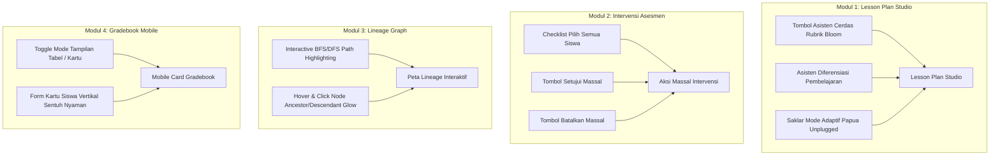

# Rencana Implementasi: Peningkatan Sistem Tingkat 1 (Smart UI & Workflow Enhancements)

Dokumen ini menguraikan rencana implementasi untuk rangkaian penyempurnaan **Tingkat 1** pada ekosistem WMVAA Akademia. Seluruh perubahan dirancang untuk memperkaya alur kerja guru, meningkatkan interaktivitas visual, dan mempermudah pengisian asesmen di perangkat bergerak.

---

## Ringkasan Fitur yang Akan Diimplementasikan



---

## 1. User Review Required

> [!IMPORTANT]
> - Penambahan tombol asisten cerdas memanfaatkan engine algoritma internal yang sudah teruji (`RubricGeneratorService`, `DifferentiationService`, `AdaptiveModeService`) dan **tidak memerlukan biaya API eksternal**.
> - Semua perubahan bersifat *backward-compatible* dan tidak mengubah skema tabel database yang sudah ada.

---

## 2. Proposed Changes

### Komponen 1: Smart AI Assistants di Lesson Plan Studio (`lesson_plans/`)

Menghubungkan endpoint AJAX dan modal asisten cerdas langsung ke halaman `app/Views/lesson_plans/detail.php` dan `create.php`.

#### [MODIFY] [SmartAnalyticsController.php](file:///e:/xampp/htdocs/wmvaa.id/public_html/app.wmvaa.id/wmvaa-akademia/app/Controllers/SmartAnalyticsController.php)
- Menambahkan endpoint `generateAdaptiveAjax()` untuk melengkapi `generateRubricAjax()` dan `generateDifferentiationAjax()`.

#### [MODIFY] [Routes.php](file:///e:/xampp/htdocs/wmvaa.id/public_html/app.wmvaa.id/wmvaa-akademia/app/Config/Routes.php)
- Mendaftarkan rute `smart/ajax/adaptive-mode` dengan filter permission `lesson_plans.manage`.

#### [MODIFY] [lesson_plans/detail.php](file:///e:/xampp/htdocs/wmvaa.id/public_html/app.wmvaa.id/wmvaa-akademia/app/Views/lesson_plans/detail.php)
- Menambahkan tombol *"✨ Asisten Cerdas"* di toolbar aksi RPP:
  1. **Modal Rubrik Bloom**: Memilih salah satu TP yang dialokasikan, generate 4-tingkat rubrik deskriptif secara instan, dan tombol 1-klik untuk menerapkan langsung ke asesmen RPP.
  2. **Modal Diferensiasi 3D**: Generate rekomendasi diferensiasi Konten, Proses, dan Produk untuk kesiapan Belajar Rendah, Sedang, Tinggi, serta tombol copy/insert ke catatan guru.
  3. **Modal Mode Adaptif Unplugged**: Rekomendasi aktivitas fisik/kertas tanpa komputer sesuai topik/konsep.

---

### Komponen 2: Aksi Massal (*Bulk Actions*) Intervensi Remedial (`assessment/interventions`)

#### [MODIFY] [AssessmentController.php](file:///e:/xampp/htdocs/wmvaa.id/public_html/app.wmvaa.id/wmvaa-akademia/app/Controllers/AssessmentController.php)
- Menambahkan metode `bulkUpdateInterventions()` yang menerima array `ids[]` dan `status` (`APPROVED` atau `CANCELLED`).

#### [MODIFY] [Routes.php](file:///e:/xampp/htdocs/wmvaa.id/public_html/app.wmvaa.id/wmvaa-akademia/app/Config/Routes.php)
- Mendaftarkan rute `POST interventions/bulk-status`.

#### [MODIFY] [assessment/interventions.php](file:///e:/xampp/htdocs/wmvaa.id/public_html/app.wmvaa.id/wmvaa-akademia/app/Views/assessment/interventions.php)
- Menambahkan kolom checkbox baris dan checkbox master *"Pilih Semua"*.
- Menambahkan bilah aksi mengambang (*Floating Bulk Action Bar*):
  - Badge jumlah siswa terpilih.
  - Tombol *"✅ Setujui Terpilih (Bulk Approve)"*.
  - Tombol *"❌ Batalkan Terpilih (Bulk Cancel)"*.

---

### Komponen 3: Interaktivitas Peta Lineage Kurikulum (`smart/lineage-graph`)

#### [MODIFY] [smart/lineage_graph.php](file:///e:/xampp/htdocs/wmvaa.id/public_html/app.wmvaa.id/wmvaa-akademia/app/Views/smart/lineage_graph.php)
- Menginjeksi data `$edges` ke variabel JavaScript `const lineageEdges = <?= json_encode($edges) ?>;`.
- Menambahkan logika penelusuran graf:
  - Saat node diklik: sorot semua node leluhur (*upstream*) dan keturunan (*downstream*).
  - Meredupkan node lain yang tidak terhubung (`opacity: 0.3`).
  - Menampilkan panel informasi ringkas di sudut layar dengan tombol *"Reset Sorotan"*.

---

### Komponen 4: Mode Kartu (*Card View*) Mobile Gradebook (`assessment/gradebook`)

#### [MODIFY] [assessment/gradebook.php](file:///e:/xampp/htdocs/wmvaa.id/public_html/app.wmvaa.id/wmvaa-akademia/app/Views/assessment/gradebook.php)
- Menambahkan tombol switch tampilan: `🖥️ Tampilan Tabel` vs `📱 Tampilan Kartu Siswa`.
- Membuat kontainer tampilan kartu vertikal untuk layar smartphone:
  - Setiap siswa dirender dalam 1 kartu bersih berisi nama, NISN, level rubrik dropdown per kriteria, skor angka, dan switch *"Lengkap"*.
  - Semua input terikat pada `name="students[...][...]"` yang sama persis sehingga proses simpan formulir tetap berjalan identik.

---

## 3. Verification Plan

### Automated Tests
1. Menjalankan test suite rute & fitur:
   ```powershell
   & "E:\xampp\php82\php.exe" vendor/bin/phpunit tests/Feature/SmartAnalyticsRoutesTest.php tests/unit/SmartAnalyticsTest.php --no-coverage
   ```
2. Menjalankan test modul asesmen dan RPP:
   ```powershell
   & "E:\xampp\php82\php.exe" vendor/bin/phpunit tests/Security/AssessmentRouteSecurityTest.php --no-coverage
   ```

### Manual Verification
1. Membuka `lesson-plans/(:segment)` dan mencoba generate Rubrik, Diferensiasi, dan Mode Adaptif.
2. Membuka `interventions`, mencentang beberapa baris, lalu melakukan Setujui Massal.
3. Membuka `smart/lineage-graph`, mengklik salah satu kartu TP, dan memastikan relasi CP $\to$ TP $\to$ ATP $\to$ RPP tersorot rapi.
4. Membuka `assessment/(:id)/gradebook` pada mode mobile (atau toggle mode kartu) dan memverifikasi pengisian nilai per kartu siswa.
