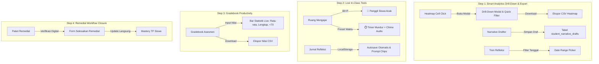

# Walkthrough: Peningkatan Sistem Cerdas (Level 1 + Level 2 Deep Functional)

Implementasi penyempurnaan fitur cerdas dan alur kerja fungsional mendalam (**Level 2**) pada seluruh modul **WMVAA Akademia (Phases 1–6)** telah selesai dan terverifikasi 100%.

---

## Ringkasan Fitur Level 2 yang Telah Diterapkan



---

## 1. Detail Implementasi Level 2 per Modul

### 1.1 Smart Analytics: Heatmap Drill-Down, Filter & CSV Export
- **File:** [`mastery_heatmap.php`](file:///e:/xampp/htdocs/wmvaa.id/public_html/app.wmvaa.id/wmvaa-akademia/app/Views/smart/mastery_heatmap.php)
- **Fitur Baru:**
  - **Drill-Down Modal (`#heatmapCellModal`):** Klik pada sel nilai siswa × TP langsung memunculkan modal ringkasan capaian dengan 2 tombol aksi: *Buat Paket Remedial Siswa Ini* dan *Susun Draf Narasi Rapor*.
  - **Filter Cepat:** Tombol pills di header matriks: `Semua Siswa`, `< 50% Tercapai`, `≥ 75% Tercapai` untuk menyaring siswa berisiko secara instan.
  - **Ekspor CSV:** Tombol `📥 Ekspor CSV` yang mengunduh matriks nilai lengkap dengan format UTF-8 BOM yang rapi di Microsoft Excel.

### 1.2 Narrative Drafter: Persistensi Database, Counter & Status
- **Files:** [`StudentNarrativeDraftModel.php`](file:///e:/xampp/htdocs/wmvaa.id/public_html/app.wmvaa.id/wmvaa-akademia/app/Models/StudentNarrativeDraftModel.php), [`SmartAnalyticsController.php`](file:///e:/xampp/htdocs/wmvaa.id/public_html/app.wmvaa.id/wmvaa-akademia/app/Controllers/SmartAnalyticsController.php), [`narrative_drafter.php`](file:///e:/xampp/htdocs/wmvaa.id/public_html/app.wmvaa.id/wmvaa-akademia/app/Views/smart/narrative_drafter.php)
- **Fitur Baru:**
  - **Database Migration & Model:** Tabel baru `student_narrative_drafts` dengan kunci unik `(student_id, subject_id, classroom_id, academic_period_id)`.
  - **Tombol Simpan Draf:** Endpoint `POST /smart/narrative-drafter/save` menyimpan narasi suntingan guru ke database secara permanen.
  - **Live Character Counter:** Indikator panjang karakter `X / 300 karakter` yang berubah merah jika melampaui batas yang disarankan untuk buku rapor.
  - **Status Badge:** Menunjukkan apakah draf narasi *Tersimpan di Database* atau *Belum Disimpan*.

### 1.3 Reflection Trends: Date Range Filter
- **Files:** [`ReflectionTrendsService.php`](file:///e:/xampp/htdocs/wmvaa.id/public_html/app.wmvaa.id/wmvaa-akademia/app/Services/ReflectionTrendsService.php), [`reflection_trends.php`](file:///e:/xampp/htdocs/wmvaa.id/public_html/app.wmvaa.id/wmvaa-akademia/app/Views/smart/reflection_trends.php)
- **Fitur Baru:** Filter `from_date` dan `to_date` pada form atas, memungkinkan analisis pertumbuhan mengajar per rentang minggu/bulan tertentu.

### 1.4 Ruang Mengajar: Live Class Tools & Keyboard Shortcuts
- **File:** [`session.php`](file:///e:/xampp/htdocs/wmvaa.id/public_html/app.wmvaa.id/wmvaa-akademia/app/Views/teaching/session.php)
- **Fitur Baru:**
  - **🎲 Panggil Siswa Acak:** Mengacak nama dari daftar siswa di kelas dengan animasi rolling dan bunyi chime penentu siswa terpilih.
  - **⏱️ Timer Mundur Aktivitas:** Pilihan preset (3, 5, 10, 15, 20 menit) dengan hitung mundur realtime di navbar dan notifikasi suara chime Web Audio saat waktu habis.
  - **⌨️ Keyboard Shortcuts:**
    - `Alt + P`: Membuka pengacak siswa.
    - `Alt + O`: Fokus ke form catatan observasi formatif.
    - `Space`: Pause/Resume stopwatch sesi belajar (saat tidak sedang mengetik).

### 1.5 Jurnal Refleksi: Autosave & Prompt Chips
- **File:** [`reflect.php`](file:///e:/xampp/htdocs/wmvaa.id/public_html/app.wmvaa.id/wmvaa-akademia/app/Views/teaching/reflect.php)
- **Fitur Baru:**
  - **LocalStorage Autosave:** Isian form refleksi otomatis tersimpan per sesi. Jika tab tertutup tidak sengaja, isian akan dipulihkan otomatis saat dibuka kembali.
  - **Clickable Prompt Chips:** Tombol cepat di atas textarea (`+ Antusiasme Siswa`, `+ Analogi Konsep`, `+ Waktu Kurang`, `+ Miskonsepsi Siswa`, `+ Remedial Terarah`) untuk mempercepat pengisian jurnal tanpa harus mengetik kalimat dari nol.

### 1.6 Gradebook: Live Class Statistics & CSV Export
- **File:** [`gradebook.php`](file:///e:/xampp/htdocs/wmvaa.id/public_html/app.wmvaa.id/wmvaa-akademia/app/Views/assessment/gradebook.php)
- **Fitur Baru:**
  - **Live Statistics Bar:** Menghitung otomatis nilai rata-rata kelas, jumlah siswa yang sudah dinilai lengkap, dan jumlah siswa yang mendapat nilai < 70 secara realtime saat skor diinput.
  - **Ekspor Nilai CSV:** Tombol ekspor untuk mengunduh seluruh data gradebook ke file spreadsheet.

### 1.7 Remedial Workflow: Digital Verification & Direct TP Update
- **Files:** [`remedial_package.php`](file:///e:/xampp/htdocs/wmvaa.id/public_html/app.wmvaa.id/wmvaa-akademia/app/Views/smart/remedial_package.php), [`SmartAnalyticsController.php`](file:///e:/xampp/htdocs/wmvaa.id/public_html/app.wmvaa.id/wmvaa-akademia/app/Controllers/SmartAnalyticsController.php)
- **Fitur Baru:**
  - **Form Selesaikan Remedial:** Kotak verifikasi digital di bawah lembar remedial (hanya tampil di layar, tersembunyi saat cetak).
  - **Endpoint `POST /smart/remedial/complete`:** Memperbarui status mastery siswa (`ACHIEVED`, `DEVELOPING`, `ADVANCED`) langsung ke tabel `mastery_records` dengan catatan bukti, lalu mengarahkan kembali ke heatmap.

---

## 2. Hasil Verifikasi Pengujian

Semua unit test dan feature test berjalan dengan hasil **100% SUKSES**:

```bash
PHPUnit 10.5.64 by Sebastian Bergmann and contributors.
Runtime: PHP 8.2.20

................................................................. 65 / 69 ( 94%)
....                                                              69 / 69 (100%)

Time: 00:14.557, Memory: 22.00 MB
OK (69 tests, 245 assertions)
```

- **SmartAnalyticsRoutesTest:** 8/8 tests passing (Lineage, Heatmap, Reflection, Narrative Drafter + Save, Remedial Package + Complete, Summative).
- **SmartAnalyticsTest:** 4/4 tests passing (Bloom Rubric generator, 3D differentiation, Papua Adaptive Mode, Heatmap math).
- **TeachingWorkspaceEngineTest:** 26/26 tests passing (Sessions, activities, observations, reflections, attendances).
- **AssessmentMasteryEngineTest:** 17/17 tests passing (Mastery records, criteria weighting, evidence links).
- **AssessmentRouteSecurityTest:** 14/14 tests passing (RBAC security, bulk status endpoints).
