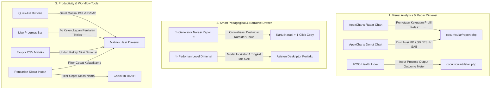

# Walkthrough: Peningkatan Cerdas UI/UX Fase 7 (Kokurikuler, Dimensi Profil, Karakter & 7KAIH)

Modul **Fase 7 (Cocurricular & Character Engine)** kini telah ditingkatkan dengan fitur analitik cerdas, visualisasi modern, asisten pedagogis narasi rapor P5, dan produktivitas pengisian hasil asesmen.

---

## Ringkasan Fitur Cerdas Fase 7 yang Telah Diimplementasikan



---

## 1. Detail Fitur Cerdas Baru per Komponen

### 1.1 Visual Radar & Donut Chart Dimensi Profil ([`report.php`](file:///e:/xampp/htdocs/wmvaa.id/public_html/app.wmvaa.id/wmvaa-akademia/app/Views/cocurricular/report.php))
- **ApexCharts Radar Chart:** Memetakan kekuatan rata-rata pencapaian kelas pada seluruh dimensi profil sasaran (Bernalar Kritis, Gotong Royong, Kreativitas, Kemandirian, dll.) dengan skala 0–100%.
- **ApexCharts Donut Chart:** Menampilkan proporsi keseluruhan level siswa: *Mulai Berkembang (MB)*, *Sedang Berkembang (SB)*, *Berkembang Sesuai Harapan (BSH)*, dan *Sangat Berkembang (SAB)*.
- **Top KPI Scorecard:** Ringkasan cepat jumlah peserta didik, dimensi sasaran, total bukti portofolio, dan **Indeks Mutu Program (IPOO)**.

### 1.2 ✨ Asisten Narasi Rapor Kokurikuler / P5 ([`report.php`](file:///e:/xampp/htdocs/wmvaa.id/public_html/app.wmvaa.id/wmvaa-akademia/app/Views/cocurricular/report.php))
- **Generator Narasi Kualitatif Otomatis:** Menggabungkan capaian dimensi tertinggi (kekuatan utama) dan area pengembangan tindak lanjut untuk setiap siswa ke dalam satu paragraf rapor yang alami dan sesuai kaidah Kurikulum Merdeka.
- **1-Click Clipboard Copy:** Tombol "Salin" per siswa dengan notifikasi toast visual yang halus, serta tombol "Salin Semua Narasi Kelas" sekaligus.

### 1.3 ✨ Asisten Pedoman Level Dimensi Profil ([`detail.php`](file:///e:/xampp/htdocs/wmvaa.id/public_html/app.wmvaa.id/wmvaa-akademia/app/Views/cocurricular/detail.php))
- **Modal Interaktif:** Tombol *"✨ Pedoman Dimensi"* membuka panduan deskriptor perilaku standar per dimensi untuk level `MB`, `SB`, `BSH`, dan `SAB`, membantu guru dalam memberikan penilaian yang objektif dan terstandar.

### 1.4 Produktivitas Matriks Hasil Capaian ([`detail.php`](file:///e:/xampp/htdocs/wmvaa.id/public_html/app.wmvaa.id/wmvaa-akademia/app/Views/cocurricular/detail.php))
- **Quick-Fill:** Tombol cepat untuk mengisi massal (misal: *Setel Semua BSH*, *Setel Semua SB*, *Setel Semua SAB*).
- **Live Progress Bar:** Indikator bar dan persentase kelengkapan pengisian sekelas yang otomatis diperbarui saat guru mengubah isian.
- **Filter Pencarian Siswa:** Input pencarian instan untuk menyaring baris nama siswa di kelas besar.
- **Ekspor CSV:** Unduh seluruh matriks nilai dimensi ke file spreadsheet dengan format UTF-8 BOM.

### 1.5 Indeks Mutu & Evaluasi IPOO ([`detail.php`](file:///e:/xampp/htdocs/wmvaa.id/public_html/app.wmvaa.id/wmvaa-akademia/app/Views/cocurricular/detail.php))
- **IPOO Health Scorecard:** Kartu 4 pilar mutu (*Input*, *Process*, *Output*, *Outcome*) dengan skor rating 1–5, persentase ketercapaian, dan status kesehatan program (*SANGAT SEHAT*, *BAIK*, *CUKUP*, *PERLU INTERVENSI*).

### 1.6 Pelacak Check-in 7KAIH Cerdas ([`checkins.php`](file:///e:/xampp/htdocs/wmvaa.id/public_html/app.wmvaa.id/wmvaa-akademia/app/Views/cocurricular/checkins.php))
- **Quick-Checkin Massal:** Tombol *Setel Semua DONE* dan *Setel Semua PARTIAL*.
- **Filter Pencarian Siswa:** Menyaring nama siswa saat check-in mingguan berlangsung.

---

## 2. Hasil Verifikasi Test Suite Penuh

Seluruh 100 test suite dari Fase 1 hingga Fase 7 berjalan **100% HIJAU TANPA ERROR**:

```bash
PHPUnit 10.5.64 by Sebastian Bergmann and contributors.
Runtime: PHP 8.2.20

...............................................................  63 / 100 ( 63%)
.....................................                           100 / 100 (100%)

Time: 00:14.386, Memory: 24.00 MB
OK (100 tests, 372 assertions)
```
