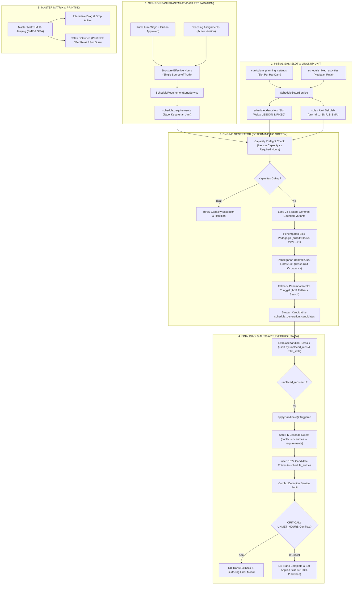

# DOKUMENTASI TEKNIS SISTEM PENJADWALAN OTOMATIS (WMVAA AKADEMIA)
## Comprehensive End-to-End Technical Audit & Architecture Specification

---

> [!IMPORTANT]
> **Status Dokumen**: Authoritative System Specification & Technical Audit
> **Ekosistem**: WMVAA HUB / WMVAA Akademia Suite
> **Lokasi File**: `E:\xampp\htdocs\wmvaa.id\public_html\app.wmvaa.id\wmvaa-akademia\docs\dev-docs\JADWAL`
> **Tanggal Audit**: 2 Agustus 2026

---

## 📋 DAFTAR ISI & STRUKTUR MODUL DOKUMENTASI

Dokumentasi ini diuraikan secara detail tanpa ada logika, skema basis data, maupun algoritma yang disembunyikan. Dokumentasi terbagi menjadi modul-modul berikut:

| Modul | Nama Dokumen | Topik & Cakupan Utama |
| :--- | :--- | :--- |
| **Master Index** | [DOKUMENTASI_SISTEM_PENJADWALAN_OTOMATIS.md](./DOKUMENTASI_SISTEM_PENJADWALAN_OTOMATIS.md) | Arsitektur Utama, End-to-End Pipeline Data, Isolasi Unit Lintas Jenjang, & Rangkuman Audit |
| **Modul 01** | [01_KURIKULUM_DAN_PEMBAGIAN_JP.md](./01_KURIKULUM_DAN_PEMBAGIAN_JP.md) | Struktur Kurikulum, Perhitungan Total JP, Verifikasi Mapel Pilihan (Fase F), Single Source of Truth |
| **Modul 02** | [02_KEGIATAN_RUTIN_DAN_SLOT_WAKTU.md](./02_KEGIATAN_RUTIN_DAN_SLOT_WAKTU.md) | Template Slot Hari/Jam, Penguncian Otomatis (*Fixed Activities*), Hari Khusus (Jumat/Rabu/Senin), & Kapasitas Efektif |
| **Modul 03** | [03_PENUGASAN_GURU_DAN_LINTAS_JENJANG.md](./03_PENUGASAN_GURU_DAN_LINTAS_JENJANG.md) | *Teaching Assignments*, *Dual Assignment*, Availability Rule, Matriks Kesibukan Lintas Unit (SMP vs SMA) |
| **Modul 04** | [04_GENERATOR_JADWAL_DETERMINISTIK.md](./04_GENERATOR_JADWAL_DETERMINISTIK.md) | *Deterministic Greedy Engine*, Pra-syarat Kapasitas, 24 Strategi Variatif, Blok Pedagogis (2+2+1), & Fallback 1-JP |
| **Modul 05** | [05_FINALISASI_DAN_PENERAPAN_OTOMATIS.md](./05_FINALISASI_DAN_PENERAPAN_OTOMATIS.md) | **[FOKUS UTAMA]** *Auto-Apply Threshold*, Eliminasi FK Cascade Violation, Deteksi & Audit Konflik (CRITICAL vs SOFT) |
| **Modul 06** | [06_MASTER_MATRIX_DAN_CETAK_DOKUMEN.md](./06_MASTER_MATRIX_DAN_CETAK_DOKUMEN.md) | Tampilan Master Matrix Lintas Jenjang, *Interactive Drag & Drop*, & Modul Cetak Dokumen (Multi-Unit/Kelas/Guru) |

---

## 🏛️ 1. ARSITEKTUR PIPELINE DATA PENJADWALAN

Sistem Penjadwalan Otomatis WMVAA Akademia mengadopsi pola **Deterministic Multi-Stage Data Pipeline** yang menghubungkan modul Kurikulum, Kegiatan Rutin, Penugasan Guru, hingga Generator dan Penerapan Otomatis.

---

## 🔒 2. ISOLASI UNIT SEKOLAH & ATURAN LINTAS JENJANG

SistemWMVAA Akademia mendukung operasional sekolah multi-jenjang (**SMP Advent Sogokmo** dan **SMA Advent Sogokmo**) yang berbagi fasilitas gedung dan beberapa tenaga pengajar (*Shared Teachers*).

### 2.1 Peta Unit Sekolah (`school_units`)
- **`unit_id = 1`**: SMP Advent Sogokmo (Tingkat / Grade 7, 8, 9)
- **`unit_id = 2`**: SMA Advent Sogokmo (Tingkat / Grade 10, 11, 12)

### 2.2 Aturan Isolasi Data (`unit_id` Enforcement)
1. **Versi Jadwal (`schedule_versions`)**:
   Setiap versi jadwal diikat secara eksplisit ke satu unit sekolah (`unit_id = 1` atau `unit_id = 2`).
2. **Sinkronisasi Kebutuhan (`syncFromAssignments`)**:
   Tabel `schedule_requirements` memfilter penugasan guru strictly berdasarkan `ta.unit_id = $version['unit_id']`. Hal ini mencegah tercampurnya kebutuhan jam mengajar SMP ke dalam jadwal SMA.
3. **Validasi Guru Lintas Unit (`getCrossUnitTeacherScheduleOccupancy`)**:
   Meskipun versi jadwal diisolasi per unit, guru yang mengajar di kedua jenjang (misal: Pak Yohanis Ondy, Bu Sarlota Yansip, Bu Maria Sinaga, Pak Frengky Lokobal) dipindai jam kesibukannya secara real-time pada tabel `schedule_entries` unit lawan.

---

## 📂 3. RINGKASAN MODUL DOKUMENTASI TEKNIS

Detail teknis secara mendalam dari setiap modul tersimpan dalam file-file terpisah pada direktori `docs/dev-docs/JADWAL`:

1. **[01_KURIKULUM_DAN_PEMBAGIAN_JP.md](./01_KURIKULUM_DAN_PEMBAGIAN_JP.md)**
   Membahas algoritma kalkulasi JP otomatis, integrasi Kurikulum Merdeka (Intrakurikuler, P5, Mapel Pilihan Fase F), verifikasi `elective_offerings.is_approved = 1`, dan sinkronisasi `schedule_requirements`.
2. **[02_KEGIATAN_RUTIN_DAN_SLOT_WAKTU.md](./02_KEGIATAN_RUTIN_DAN_SLOT_WAKTU.md)**
   Membahas pembuatan template hari/jam (`schedule_day_slots`), penguncian otomatis kegiatan rutin (`schedule_fixed_activities`), dan rumus kalkulasi kapasitas efektif slot jam pelajaran (`baseLessonCapacity - fixedCount`).
3. **[03_PENUGASAN_GURU_DAN_LINTAS_JENJANG.md](./03_PENUGASAN_GURU_DAN_LINTAS_JENJANG.md)**
   Membahas pengelolaan penugasan mengajar (`teaching_assignments`), aturan ketersediaan guru (`teacher_availability_rules`), dan fungsi deteksi bentrok ganda lintas unit.
4. **[04_GENERATOR_JADWAL_DETERMINISTIK.md](./04_GENERATOR_JADWAL_DETERMINISTIK.md)**
   Membahas arsitektur *Deterministic Greedy Engine*, pemeriksaan pra-syarat kapasitas (*Preflight Check*), 24 variasi strategi pemetaan, alokasi blok 2-JP, dan *fallback* slot 1-JP.
5. **[05_FINALISASI_DAN_PENERAPAN_OTOMATIS.md](./05_FINALISASI_DAN_PENERAPAN_OTOMATIS.md)** **[FOKUS UTAMA]**
   Membahas secara mendetail alur pengeksekusian `applyCandidate`, eliminasi kegagalan *Foreign Key Constraint*, evaluasi *Auto-Apply Threshold*, dan klasifikasi tingkat keparahan konflik.
6. **[06_MASTER_MATRIX_DAN_CETAK_DOKUMEN.md](./06_MASTER_MATRIX_DAN_CETAK_DOKUMEN.md)**
   Membahas rendering UI Master Matrix Multi-Jenjang, penggeseran manual kartu pelajaran (*Drag & Drop*), dan modul cetak dokumen jadwal.

---
*Dokumen ini dibuat dan dipelihara oleh Tim Antigravity Antigravity Core AI Architecture untuk WMVAA Akademia.*
