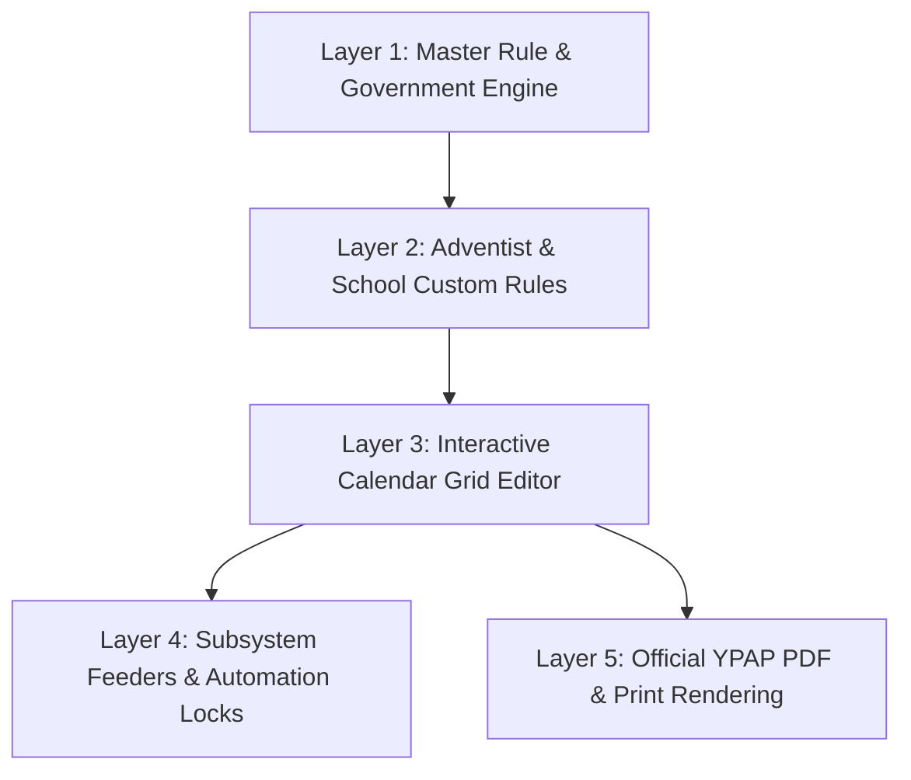

# 📅 KONSEP DASAR PENGEMBANGAN KALENDER PENDIDIKAN
## WMVAA AKADEMIA — YAYASAN PENDIDIKAN ADVENT PAPUA (YPAP)

---

## 1. PENDAHULUAN & LATAR BELAKANG

Kalender Pendidikan merupakan pijakan utama dalam seluruh perencanaan akademik sekolah. Seluruh modul di **WMVAA Akademia** — seperti Penjadwalan Pelajaran Otomatis (*Scheduling Engine*), Penugasan Mengajar Guru (*Workload*), Presensi Siswa & Jurnal Mengajar (*Attendances*), hingga Jadwal Piket Sekolah — sangat bergantung pada keabsahan dan presisi kalender pendidikan.

Dalam ekosistem sekolah **SMP-SMA Advent Sogokmo (WMVAA YPAP)** di Kabupaten Jayawijaya, penyusunan kalender pendidikan memiliki dua dimensi aturan yang harus diselaraskan secara harmonis:

1. **Dimensi Regulasi Pemerintah (Dinas Pendidikan & Kebudayaan Kabupaten Jayawijaya)**:
   - Menetapkan tanggal libur nasional, keagamaan daerah (seperti HUT GKI di Tanah Papua, Cuti Advent, Hari Pekabaran Injil Papua/Papua Pegunungan), perkiraan ujian nasional/asesmen, perkiraan penilaian tengah/akhir semester, dan rentang libur semester.
   - Menetapkan acuan minimal **Hari Efektif Sekolah (HES)**, **Hari Efektif Belajar (HEB)**, dan **Jumlah Minggu Efektif**.
2. **Dimensi Karakteristik Khusus Sekolah Advent (YPAP / WMVAA)**:
   - **Hari Sabat (Sabtu)** merupakan hari peribadatan dan hari libur utama bagi seluruh Civitas Academica Advent (Non-Effective Day).
   - **Hari Minggu** merupakan hari libur umum/pekanan.
   - Adanya agenda peribadatan dan pengembangan karakter khusus Advent seperti:
     - *10 Hari Berdoa*
     - *Teacher's Prime Time (PT)*
     - *Sabat Pendidikan & Sabat OSIS*
     - *Minggu Pelayanan*
     - *Penyusunan Dokumen Sekolah/Guru (PDSG)*
     - *Penamatan (Graduation)*

Dengan demikian, **Modul Generate Otomatis Kalender Pendidikan** di rancang untuk menjembatani kedua dimensi ini: mengimpor acuan standar Dinas Pendidikan Jayawijaya dan secara otomatis menerapkan aturan khusus Sekolah Advent secara presisi, cepat, dan 100% tuntas.

---

## 2. ANALISIS DOKUMEN ACUAN & PERSYARATAN DATA

### 2.1. Acuan Dinas Pendidikan Kabupaten Jayawijaya (TA 2026/2027)
Berdasarkan *Lampiran Keputusan Kepala Dinas Pendidikan dan Kebudayaan Kabupaten Jayawijaya Nomor 400.3/1473.a/P&K/2026 Tanggal 16 Juni 2026*, acuan kalender memiliki parameter berikut:

#### A. Kode & Kategori Acuan Dinas:
- **`M`**: Hari Minggu (Libur Pekanan)
- **`LU / CB`**: Libur Umum / Cuti Bersama National/Daerah
- **`MPLS`**: Masa Pengenalan Lingkungan Sekolah (SMP/SMA)
- **`PTS`**: Penilaian Tengah Semester / Formatif
- **`PAS`**: Penilaian Akhir Semester / Sumatif
- **`UAS`**: Ujian Akhir Sekolah (SMP/SMA/SMK)
- **`R1 / R2`**: Penerimaan Rapor Semester 1 / Semester 2
- **`LS1 / LS2`**: Libur Semester 1 / Libur Semester 2
- **`AN`**: Perkiraan Asesmen Nasional (ANBK)
- **`PDSG`**: Penyusunan Dokumen Sekolah/Guru (Persiapan TA Baru)

#### B. Hari Libur Umum & Cuti Bersama Tahun 2026 (Kab. Jayawijaya):
1. **17 Agustus 2026**: Hari Kemerdekaan RI ke-81
2. **25 Agustus 2026**: Maulid Nabi Muhammad SAW
3. **26 Oktober 2026**: HUT GKI di Tanah Papua *(Libur Khusus Daerah Papua)*
4. **1 Desember 2026**: Cuti Bersama Masa Advent *(Libur Khusus Daerah Papua)*
5. **24 Desember 2026**: Cuti Bersama Hari Raya Natal
6. **25 - 26 Desember 2026**: Hari Raya Natal & Natal Kedua

#### C. Hari Libur Umum & Cuti Bersama Tahun 2027 (Kab. Jayawijaya):
1. **1 Januari 2027**: Tahun Baru Masehi 2027
2. **5 Januari 2027**: Isra' Mi'raj Nabi Muhammad SAW
3. **5 Februari 2027**: Hari Pekabaran Injil di Tanah Papua *(Libur Khusus Daerah Papua)*
4. **6 Februari 2027**: Tahun Baru Imlek 2578
5. **9 Maret 2027**: Hari Raya Nyepi Tahun Saka 1949
6. **10 - 11 Maret 2027**: Perkiraan Idul Fitri 1448 H
7. **26 Maret 2027**: Wafat Isa Almasih (Jumat Agung)
8. **28 - 29 Maret 2027**: Hari Raya Paskah & Cuti Paskah Kedua
9. **20 April 2027**: Hari Pekabaran Injil di Papua Pegunungan *(Libur Khusus Daerah)*
10. **1 Mei 2027**: Hari Buruh Internasional
11. **6 Mei 2027**: Kenaikan Isa Almasih
12. **17 Mei 2027**: Idul Adha 1448 H
13. **20 Mei 2027**: Hari Raya Waisak
14. **1 Juni 2027**: Hari Lahir Pancasila
15. **6 Juni 2027**: Tahun Baru Hijriah 1449 H

#### D. Target Kuantitatif Dinas (Jayawijaya TA 2026/2027):
- **Hari Efektif Sekolah (HES)**:
  - Semester 1: **134 Hari**
  - Semester 2: **123 Hari**
  - Total HES (Sem 1 + Sem 2): **257 Hari**
- **Hari Efektif Belajar (HEB)**:
  - Semester 1: **118 Hari**
  - Semester 2: **115 Hari**
  - Total HEB (Sem 1 + Sem 2): **233 Hari**
- **Jumlah Minggu Efektif**:
  - Semester 1: **19 Minggu**
  - Semester 2: **19 Minggu**
  - Total Minggu Efektif: **38 Minggu**

---

### 2.2. Format & Karakteristik Khusus WMVAA Advent Sogokmo
Berdasarkan dokumen *Desain Format Kalender Pendidikan SMP-SMA Advent Sogokmo T.A. 2024/2025 - Semester 2*, terdapat penyesuaian khusus yang wajib diakomodasi oleh sistem:

#### A. Kode Warna & Agenda Khusus Sekolah Advent:
- **`S` (Hitam / Charcoal)**: **Hari Sabtu (Sabat)** $\rightarrow$ Hari libur ibadah utama Advent (Selalu Non-Effective).
- **`M` (Abu-Abu)**: **Hari Minggu** $\rightarrow$ Hari libur pekanan.
- **`PT` (Kuning Emas / Amber)**: **Teacher's Prime Time** $\rightarrow$ Program pembinaan spiritual & profesionalisme guru.
- **`S` (Ungu / Indigo)**: **Sabat Pendidikan & Sabat OSIS** $\rightarrow$ Kebaktian khusus sekolah & siswa di hari Sabat.
- **`M` (Biru / Cyan)**: **Minggu Pelayanan** $\rightarrow$ Program outreach/pelayanan masyarakat oleh civitas akademika.
- **`P` (Cokelat Tua / Maroon)**: **Pleno Penilaian Siswa & Penamatan (Graduation)**.
- **`10 Hari Berdoa`**: Agenda peribadatan 10 hari awal semester Advent.
- **`Supervisi Guru`**: Periode evaluasi & supervisi pembelajaran oleh Direktur/Kepala Sekolah.

#### B. Matriks Tampilan Visual WMVAA:
- Struktur tabel berbasis baris bulan (Juli s.d. Juni) dan kolom tanggal ($1 \text{ s.d. } 31$).
- Kolom ringkasan per bulan:
  1. **HES** (Hari Efektif Sekolah)
  2. **HEB** (Hari Efektif Belajar)
  3. **MINGGU EFEKTIF BELAJAR**
  4. **MINGGU EFEKTIF**
- Blok legenda warna (*Color Legend Key*).
- Blok Program Sekolah Lainnya.
- Blok pengesahan resmi oleh Direktur SMP-SMA Advent Sogokmo.

---

## 3. KONSEP 5-LAYER ARSITEKTUR KALENDER PENDIDIKAN

Sistem Kalender Pendidikan WMVAA Akademia dirancang menggunakan **5-Layer Architecture** untuk menjamin fleksibilitas, presisi, dan performa tinggi:

### Layer 1: Master Rule & Government Engine (Dinas Defaults)
- Menyediakan pustaka (*library*) tanggal libur nasional, keagamaan daerah Papua/Jayawijaya, serta rentang jadwal penilaian nasional.
- Menyimpan template bawaan Dinas Jayawijaya untuk setiap Tahun Ajaran.

### Layer 2: Adventist & School Custom Rules (Aturan Khusus YPAP)
- Secara otomatis mengubah status seluruh hari Sabtu menjadi `Sabat` (`S`) dengan *learning_effective = false*.
- Memasukkan kegiatan rutin tahunan Advent (10 Hari Berdoa, Prime Time Guru, Sabat Pendidikan, Minggu Pelayanan, Penamatan).

### Layer 3: Interactive Calendar Grid Editor (Editor Visual 1..31)
- Antarmuka visual berbasis grid matriks bulan x tanggal (1..31).
- Dilengkapi alat *quick-paint* (klik & drag tanggal) untuk mengubah status hari atau menambah kegiatan secara instant.
- Fitur kalkulasi otomatis real-time untuk nilai HES, HEB, dan Jumlah Minggu Efektif.

### Layer 4: Subsystem Feeders & Automation Locks (Integrasi Sistem)
- **Modul Penjadwalan Otomatis (`schedules`)**: Mencegah penempatan jam pelajaran pada hari libur/non-efektif.
- **Modul Presensi Siswa (`attendances`)**: Mengunci form absensi agar guru tidak dapat menginput presensi di hari libur.
- **Modul Piket Guru (`duty_schedules`)**: Otomatis mengecualikan hari libur dari jadwal piket.

### Layer 5: Official YPAP PDF & Print Rendering (Cetak Dokumen Resmi)
- Menghasilkan cetakan PDF Landscape presisi tinggi yang 100% identik dengan format resmi WMVAA YPAP.
- Dilengkapi Kop Sekolah, Tabel Matriks 1..31, Legenda Warna, Daftar Libur Nasional/Daerah, Daftar Program Sekolah, dan Blok Tanda Tangan Direktur.

---

## 4. FORMULA KALKULASI MATEMATIS OTOMATIS

Sistem secara otomatis menghitung metrik kalender pendidikan untuk setiap bulan dan akumulasi semester:

### 4.1. Hari Efektif Sekolah (HES)
$$HES = \sum_{d \in Bulan} \mathbb{I}(\text{day\_type} \notin \{LU, CB, S, M, LS1, LS2\})$$
*Keterangan: HES mencakup semua hari di mana sekolah beraktivitas resmi (termasuk ujian, MPLS, PDSG, dan pembagian rapor).*

### 4.2. Hari Efektif Belajar (HEB)
$$HEB = \sum_{d \in Bulan} \mathbb{I}(\text{day\_type} = HEB \land \text{is\_learning\_effective} = \text{true})$$
*Keterangan: HEB khusus menghitung hari terjadinya Kegiatan Belajar Mengajar (KBM) tatap muka reguler (tidak termasuk ujian, libur, MPLS, dan penerimaan rapor).*

### 4.3. Minggu Efektif Belajar
$$\text{Minggu Efektif} = \left\lfloor \frac{HEB_{\text{bulan}}}{5} \right\rfloor \quad \text{atau berdasarkan ambang batas } \ge 3 \text{ hari HEB dalam 1 minggu.}$$

---

*Dokumen Konsep Dasar ini menjadi acuan utama pengembangan spesifikasi teknis dan eksekusi skema database Modul Kalender Pendidikan WMVAA Akademia.*
