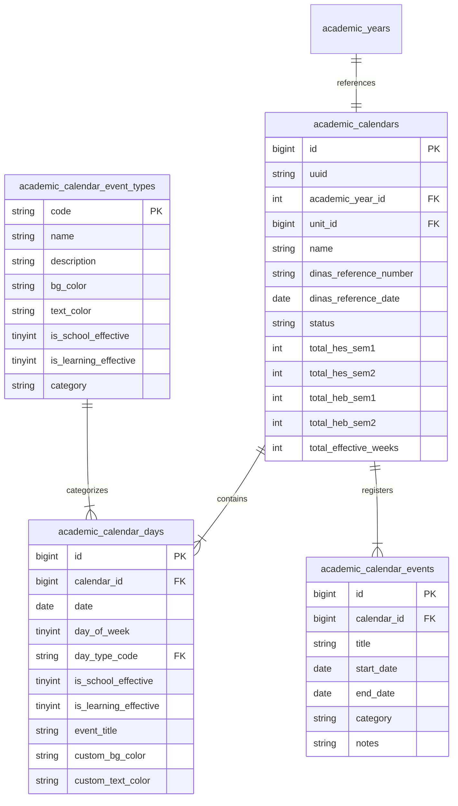

# 🛠️ SPESIFIKASI TEKNIS DAN DESAIN SISTEM
## MODUL KALENDER PENDIDIKAN (AUTOMATIC EDUCATIONAL CALENDAR GENERATOR)
### WMVAA AKADEMIA — YAYASAN PENDIDIKAN ADVENT PAPUA (YPAP)

---

## 1. SKEMA DATABASE & MODEL DATA (MYSQL / MARIA DB)

Untuk mendukung fleksibilitas tinggi dan integrasi lintas unit (SMP & SMA), skema database dirancang menjadi 4 tabel utama:



### 1.1. Tabel `academic_calendar_event_types` (Kamus Tipe Hari & Legenda Warna)
| Nama Kolom | Tipe Data | Keterangan |
| :--- | :--- | :--- |
| `code` | `VARCHAR(20)` | **PRIMARY KEY** (e.g. `HEB`, `SABAT`, `MINGGU`, `LU`, `CB`, `LS1`, `LS2`, `PT`, `PAS`, `PTS`, `US`, `PDSG`, `P`) |
| `name` | `VARCHAR(100)` | Nama Tipe Hari (e.g. *Hari Efektif Belajar*, *Hari Sabtu (Sabat)*, *Teacher's Prime Time*) |
| `bg_color` | `VARCHAR(7)` | Kode Warna Hex Background (e.g. `#000000`, `#ef4444`, `#f59e0b`, `#10b981`) |
| `text_color` | `VARCHAR(7)` | Kode Warna Hex Teks (e.g. `#ffffff`, `#000000`) |
| `is_school_effective` | `TINYINT(1)` | Status Hari Efektif Sekolah (1 = Ya, 0 = Tidak) |
| `is_learning_effective` | `TINYINT(1)` | Status Hari Efektif Belajar (1 = Ya, 0 = Tidak) |
| `category` | `VARCHAR(30)` | Kategori (`HARI_LIBUR`, `UJIAN`, `KEGIATAN_ADVENT`, `KEGIATAN_SEKOLAH`) |

### 1.2. Tabel `academic_calendars` (Header Kalender Pendidikan)
| Nama Kolom | Tipe Data | Keterangan |
| :--- | :--- | :--- |
| `id` | `BIGINT UNSIGNED` | **PRIMARY KEY**, Auto Increment |
| `uuid` | `CHAR(36)` | Unique Identifiers (UUID v4) |
| `academic_year_id` | `INT UNSIGNED` | **FOREIGN KEY** `academic_years.id` |
| `unit_id` | `BIGINT UNSIGNED` | **FOREIGN KEY** `school_units.id` (SMP / SMA / All) |
| `name` | `VARCHAR(150)` | Nama Kalender (e.g. *Kalender Pendidikan SMP-SMA Advent Sogokmo TA 2026/2027*) |
| `dinas_reference_number` | `VARCHAR(100)` | No. SK Dinas (e.g. *400.3/1473.a/P&K/2026*) |
| `dinas_reference_date` | `DATE` | Tanggal SK Dinas (e.g. *2026-06-16*) |
| `status` | `VARCHAR(20)` | Status Kalender (`DRAFT`, `ACTIVE`, `ARCHIVED`) |
| `total_hes_sem1` | `INT` | Total HES Semester 1 |
| `total_hes_sem2` | `INT` | Total HES Semester 2 |
| `total_heb_sem1` | `INT` | Total HEB Semester 1 |
| `total_heb_sem2` | `INT` | Total HEB Semester 2 |
| `total_effective_weeks` | `INT` | Total Minggu Efektif |
| `created_by` | `INT UNSIGNED` | User ID Pembuat |
| `created_at` | `DATETIME` | Waktu Pembuatan |
| `updated_at` | `DATETIME` | Waktu Pembaharuan |

### 1.3. Tabel `academic_calendar_days` (Detail Hari per Tanggal)
| Nama Kolom | Tipe Data | Keterangan |
| :--- | :--- | :--- |
| `id` | `BIGINT UNSIGNED` | **PRIMARY KEY**, Auto Increment |
| `calendar_id` | `BIGINT UNSIGNED` | **FOREIGN KEY** `academic_calendars.id` |
| `date` | `DATE` | Tanggal Kalender (e.g. *2026-08-17*) |
| `day_of_week` | `TINYINT` | Angka Hari (1=Senin, 6=Sabtu, 7=Minggu) |
| `day_type_code` | `VARCHAR(20)` | **FOREIGN KEY** `academic_calendar_event_types.code` |
| `is_school_effective` | `TINYINT(1)` | Flag Efektif Sekolah |
| `is_learning_effective` | `TINYINT(1)` | Flag Efektif Belajar |
| `event_title` | `VARCHAR(255)` | Keterangan Nama Hari / Libur (e.g. *HUT Kemerdekaan RI ke-81*) |
| `custom_bg_color` | `VARCHAR(7)` | Override Warna Background (opsional) |
| `custom_text_color` | `VARCHAR(7)` | Override Warna Teks (opsional) |

### 1.4. Tabel `academic_calendar_events` (Program Sekolah Lainnya)
| Nama Kolom | Tipe Data | Keterangan |
| :--- | :--- | :--- |
| `id` | `BIGINT UNSIGNED` | **PRIMARY KEY**, Auto Increment |
| `calendar_id` | `BIGINT UNSIGNED` | **FOREIGN KEY** `academic_calendars.id` |
| `title` | `VARCHAR(255)` | Nama Program (e.g. *10 Hari Berdoa*, *Teacher Prime Time*) |
| `start_date` | `DATE` | Tanggal Mulai |
| `end_date` | `DATE` | Tanggal Selesai |
| `category` | `VARCHAR(50)` | Kategori Program |
| `notes` | `TEXT` | Catatan Keterangan Tambahan |

---

## 2. ALGORITMA GENERATE OTOMATIS (CALENDAR GENERATOR ENGINE)

Proses pembuatan kalender pendidikan otomatis ditangani oleh `App\Services\AcademicCalendarGeneratorService` melalui 5 tahap berurutan:

```php
public function generateAutomaticCalendar(int $academicYearId, int $unitId, string $dinasTemplate = 'JAYAWIIJAYA_2026_2027'): array
{
    // Tahap 1: Ekspansi Matriks Tanggal (365/366 Hari dari Juli YYYY s.d. Juni YYYY+1)
    $dates = $this->expandDateMatrix($academicYearId);

    // Tahap 2: Injeksi Hari Libur Nasional & Daerah (Dinas Jayawijaya Rules)
    $dates = $this->applyGovernmentHolidays($dates, $dinasTemplate);

    // Tahap 3: Penerapan Aturan Khusus Sekolah Advent (YPAP Rules)
    // - Setiap Sabtu = Sabat (Non-Effective)
    // - Setiap Minggu = Libur Pekanan
    // - Auto-set 10 Hari Berdoa, Teacher Prime Time, Sabat Pendidikan, PDSG
    $dates = $this->applyAdventistSchoolRules($dates);

    // Tahap 4: Rekalkulasi Otomatis HES, HEB, & Minggu Efektif
    $metrics = $this->calculateCalendarMetrics($dates);

    // Tahap 5: Persistensi ke Database dalam DB Transaction
    return $this->saveGeneratedCalendar($academicYearId, $unitId, $dates, $metrics);
}
```

---

## 3. INTEGRASI DENGAN SUB-SISTEM LAIN DI WMVAA AKADEMIA

Modul Kalender Pendidikan terhubung secara seamless dengan 3 sub-sistem utama:

1. **Mesin Penjadwalan Otomatis (`DeterministicGreedyScheduleGenerator`)**:
   - Generator jadwal membaca tabel `academic_calendar_days`.
   - Hari dengan `is_learning_effective = 0` (seperti Libur Nasional, Sabat, Cuti Bersama, Libur Semester) **secara otomatis dikunci (*Hard Lock*)**, sehingga tidak ada jam pelajaran yang ditempatkan pada tanggal tersebut.
2. **Sistem Presensi Siswa & Jurnal Kelas (`AttendancesController`)**:
   - Saat Guru memilih tanggal presensi, sistem memvalidasi tanggal tersebut pada `academic_calendar_days`.
   - Jika tanggal jatuh pada hari libur/non-efektif, form presensi akan mengunci (*readonly*) dan menampilkan badge peringatan hari libur resmi.
3. **Penugasan Guru & Jadwal Piket (`DutySchedulesController`)**:
   - Pembuatan jadwal piket harian guru secara otomatis mengabaikan tanggal-tanggal libur yang terdaftar di kalender pendidikan.

---

## 4. PERANCANGAN STRUKTUR ROUTING & CONTROLLER

### 4.1. Config Routes (`app/Config/Routes.php`)
```php
$routes->group('academic-calendar', ['filter' => 'permission:academic_periods.view'], static function ($routes) {
    $routes->get('/', 'AcademicCalendarController::index');
    $routes->get('create', 'AcademicCalendarController::create');
    $routes->post('generate', 'AcademicCalendarController::generate');
    $routes->get('(:num)/editor', 'AcademicCalendarController::editor/$1');
    $routes->post('(:num)/update-day', 'AcademicCalendarController::updateDay/$1');
    $routes->post('(:num)/events/store', 'AcademicCalendarController::storeEvent/$1');
    $routes->post('(:num)/events/(:num)/delete', 'AcademicCalendarController::deleteEvent/$1/$2');
    $routes->get('(:num)/print', 'AcademicCalendarController::printPdf/$1');
    $routes->get('(:num)/export-excel', 'AcademicCalendarController::exportExcel/$1');
    $routes->post('(:num)/activate', 'AcademicCalendarController::activate/$1');
});
```

### 4.2. Class Architecture:
- **`App\Controllers\AcademicCalendarController.php`**: Controller utama penanganan request UI, AJAX cell paint update, dan pemanggilan service.
- **`App\Services\AcademicCalendarGeneratorService.php`**: Engine generator otomatis & ekspansi matriks tanggal.
- **`App\Services\AcademicCalendarCalculationService.php`**: Engine kalkulator presisi untuk HES, HEB, dan Minggu Efektif.
- **`App\Services\AcademicCalendarExportService.php`**: Handler cetak PDF Landscape resmi YPAP dan ekspor spreadsheet.

---

## 5. SPESIFIKASI LAYOUT CETAK PDF RESMI YPAP (LANDSCAPE)

Tampilan cetak kalender pendidikan dirancang untuk menghasilkan keluaran PDF Landscape standar YPAP yang memuat:

1. **Kop Resmi Sekolah**:
   - Logo YPAP Advent.
   - Nama Yayasan: `YAYASAN PENDIDIKAN ADVENT PAPUA (YPAP)`.
   - Judul Unit: `WAMENA MOUNTAIN VIEW ADVENTIST ACADEMY - SMP-SMA ADVENT SOGOKMO`.
   - Sub-Header: `KALENDER PENDIDIKAN T.A. 2026/2027`.
2. **Matriks Kalender Utama**:
   - Baris: Bulan (Juli s.d. Juni).
   - Kolom: Tanggal 1 s.d. 31 + Kolom Rekap (HES, HEB, MINGGU EFEKTIF BELAJAR, MINGGU EFEKTIF).
   - Setiap sel tanggal diwarnai sesuai dengan kode warna legenda (misal: Hitam untuk Sabat, Merah untuk Libur Umum, Kuning untuk Prime Time Guru, Hijau untuk PAS, dsb).
3. **Blok Legenda Warna (*Keterangan Warna*)**:
   - Menampilkan daftar seluruh simbol warna dan penjelasannya.
4. **Blok Keterangan Libur Umum & Cuti Bersama**:
   - Daftar penomoran hari libur nasional dan cuti bersama sesuai SK Dinas Jayawijaya.
5. **Blok Program Sekolah Lainnya**:
   - Daftar kegiatan internal WMVAA (10 Hari Berdoa, Teacher Prime Time, Supervisi Guru, Persiapan Penamatan, Persiapan TA Baru).
6. **Blok Pengesahan Resmi**:
   - Lokasi & Tanggal Penetapan: `Ditetapkan di: SOGOKMO`.
   - Tanda Tangan Resmi Direktur SMP-SMA Advent Sogokmo (`NOD WINDEWANI, SE`).

---

*Dokumen Spesifikasi Teknis ini siap dijadikan panduan eksekusi pengkodean (implementation guide) untuk Modul Kalender Pendidikan WMVAA Akademia.*
